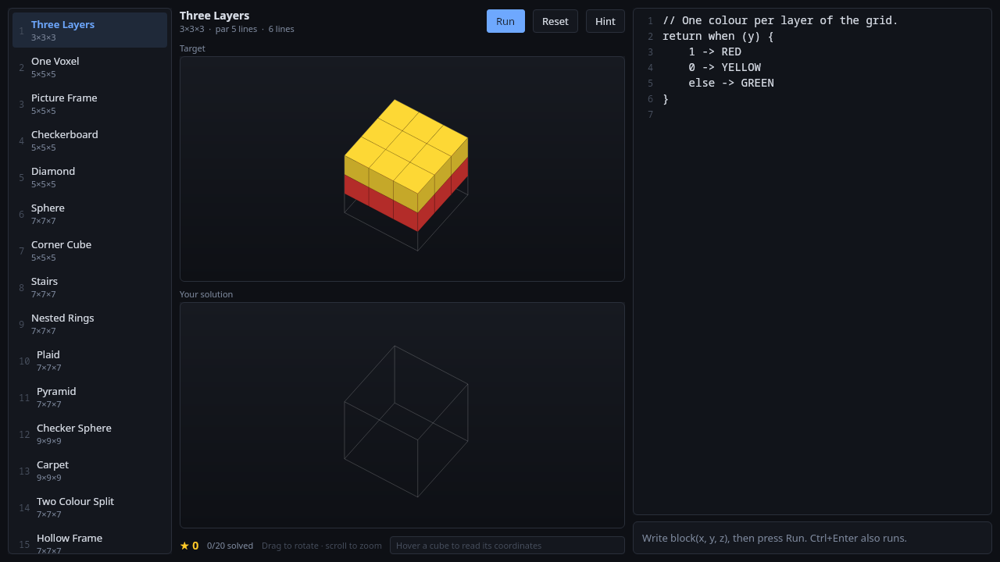
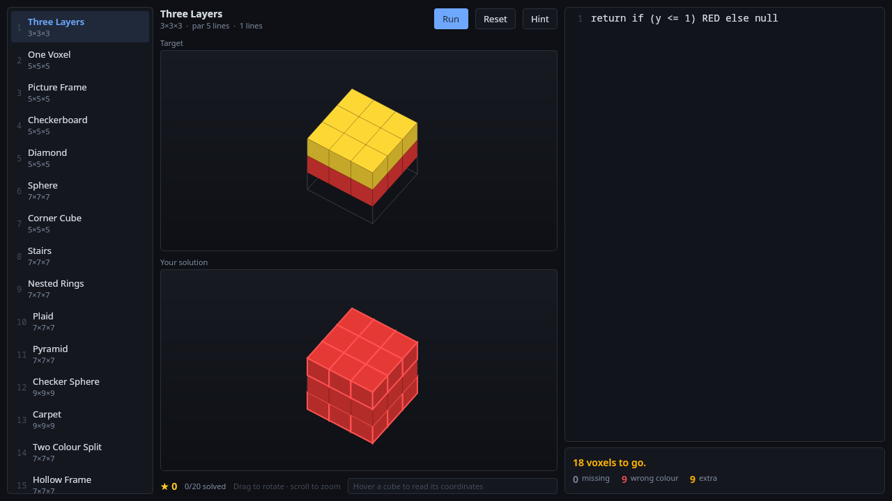
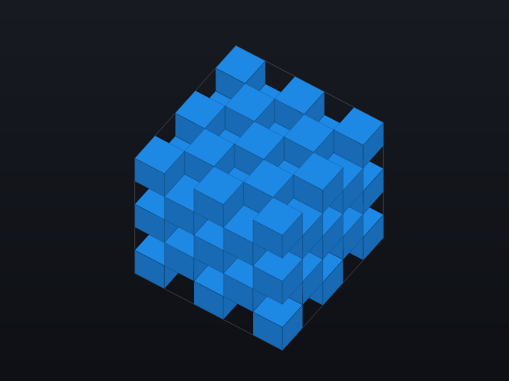

# replikube

Reproduce a 3D voxel shape by writing Kotlin code.

Every level asks for the same thing — the **body** of a function that returns a colour for
each voxel, or `null` for empty:

```kotlin
when (y) {
    1 -> RED
    0 -> YELLOW
    else -> GREEN
}
```

Press **Run**. The code is compiled with `K2JVMCompiler`, executed, and graded voxel by
voxel against the level's target. What you get back is not a pass/fail: a count of missing,
wrong-colour and extra voxels, outlined in red in the viewport.

The target and your solution are stacked, and both are drawn solid — the whole point is to
compare them, which only works if the two pictures are comparable and from the same angle.
Dragging either pane rotates both.

When a shape is solid, three sliders under the panes cut it open: each sets the highest
layer still visible on one axis, and everything above is removed. Nothing is made
translucent, because translucency in front of opaque cubes does not reveal depth — it just
makes the shape harder to read.



*A failed attempt. The target is on top, your solution below, from one shared camera. The
voxels that do not match are outlined.*



Every level's target is drawn by the same painter, and it is the only thing in the project
that a unit test cannot check for you — so the test suite renders each one to a PNG, with
no window involved. The editor is syntax-highlighted the way an IDE would: a hand-written
lexer behind a `VisualTransformation`, with palette constants painted in their own colour,
lifted toward white by the least amount that keeps them readable against the background. In
the app, hovering a cube fills it white and pins its coordinates and palette name to the
status line:



**[Design & implementation plan →](docs/DESIGN.md)**

## Running it

```
export JAVA_HOME=/home/bob/.jdks/jbrsdk_jcef-21.0.7   # or any JDK 21
./gradlew :app:run
```

```
./gradlew test          # all modules
./gradlew build         # compile + test
```

## Packaging

```
./gradlew :app:packageAppImage
app/build/compose/binaries/main/app/replikube/bin/replikube
```

`packageAppImage` runs `jpackage --type app-image` and produces a **directory**, not a
squashfs `.AppImage` — that needs `appimagetool` or `linuxdeploy`, which are not present on
every machine. The directory is a complete, self-contained app: its own JBR, its own jars.

When something behaves differently there than under `:app:run`, the app writes a log:

```
REPLIKUBE_LOG=/tmp/replikube.log ./bin/replikube
```

Without it, to `$XDG_STATE_HOME/replikube/replikube.log` (or `~/.local/state/...`), falling
back to the temp directory. Always on, mirrored to stderr, truncated at 512 KB, and it never
throws — a logging failure must not become the failure you were trying to diagnose.

## How it is put together

| module | what it is |
|---|---|
| `:dsl` | the entire vocabulary a player sees: 17 palette constants and a handful of geometry helpers. Zero dependencies, and nothing depends on it but player code |
| `:core` | `Coord`, `GridSize`, `VoxelGrid`, `Verifier`, `Stars`, and an ASCII renderer for authoring levels in the terminal |
| `:scripting` | `ScriptRunner` — the one place that knows a compiler exists. Everything above it sees a grid and a diagnostic |
| `:levels` | 20 levels, one `.json` file each — metadata, the target matrix, and the reference solution the Reveal button shows. Discovered by enumerating the resource directory |
| `:app` | Compose Desktop UI, the game state machine, and local progress |

**A level's shape is data, not a compiled program.** Each level stores its target as a flat
row-major matrix of palette ids, so opening a level is a parse and needs no compiler at
runtime. The reference solution lives beside it as text and is never executed to build the
target.

This was not the original design, and the reason is worth stating plainly: defining the
target as "whatever the reference solution compiles to" meant the packaged app needed a
working Kotlin compiler just to *show* a level. Every way that can go wrong — a jlink
runtime without `jdk.compiler`, a stripped `kotlin-compiler-embeddable`, a bytecode target
newer than the bundled JVM — took all twenty levels down at once, with an error naming
neither the level nor the cause. The trade is a second representation that could disagree,
and `:levels` closes that gap with a test that compiles all twenty reference solutions and
asserts each reproduces its stored matrix exactly. The guarantee survives; the runtime
compiler dependency is gone.

## Authoring a level

Drop `levels/src/main/resources/levels/<id>.json` next to the others:

```json
{
  "id": "my-level", "title": "My Level", "difficulty": 5,
  "size": { "x": 5, "y": 5, "z": 5 }, "par": 3,
  "hint": "Look at the coordinates you are given.",
  "target": [0, 15, 15, 15, 15, 0, 0, 0, 0, 0, 0, 0, 0, 0, 0, 0, 0, 0, 0, 0, 0, 0, 0, 0, 0],
  "reference": "return if (inCube(x, y, z, 1)) MAGENTA else null"
}
```

`target` holds `x * y * z` palette ids, `0` meaning empty, with **x varying fastest, then
y, then z** — the same order as `GridSize.indexOf`. `reference` is a Kotlin body, shown by
Reveal once you beat the level.

Write the `reference` first and let the tooling fill in `target`:

```
REPLIKUBE_REGENERATE=true ./gradlew :levels:test --tests '*GenerateTargetsTest*'
```

`LevelCatalogTest` fails the build if the solution does not compile, does not reproduce the
stored matrix, if the matrix length does not match the declared size, or if a resource is
unlabelled. To eyeball every level without launching the game:

```
./gradlew :levels:test --tests '*showEveryLevel*' --rerun-tasks -i
```

## Seeing the renderer without a window

```
./gradlew :app:test --tests '*RenderTest*' --rerun-tasks -i
open app/build/renders/
```

Every level's target is written out as a PNG through `ImageComposeScene`, along with the
whole screen. It is the fastest way to see what a change to `Projection` did, and the only
thing that catches a crash in a composable. The run also prints an ASCII silhouette of each
frame, because a PNG cannot be diffed in a terminal. The screenshots above are copies of
those renders.

Three real bugs came out of doing it this way rather than by eye: a projection missing a
`cos(30°)` factor, which drew every grid four times too narrow; a viewport that drew
*nothing* in the default view mode, because the target was gated behind a toggle; and a
camera that could be dragged without ever invalidating the draw phase, so the canvas kept
showing the previous frame while the object behind it had moved. In all three the
assertions about the camera angles passed, because the angles really did change.
